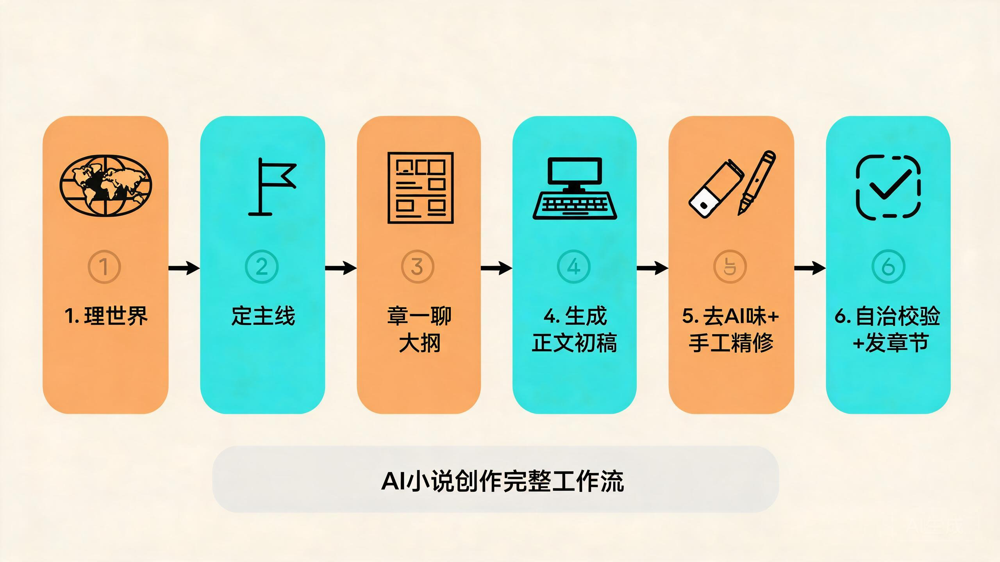

# AI Novel Writing · AI 写小说工具集


> 喜欢的话点个 ⭐ Star，方便以后找到；也欢迎 **Fork** 一份拿去改，或开 PR 把你的经验补充进来。

用 AI 从 0 到上架一部小说，我自己跑完 10 万字的真实经验沉淀。

这不是一篇"教你赚钱"的营销文，而是把我在 AI 辅助写小说这条路上反复打磨、验证过的**提示词模板、完整工作流、工具对比**整理成的开源仓库。全部内容免费，欢迎 fork 使用，也欢迎 PR 补充你的经验。

> 🔎 如果你只想快速上手：先看 [`docs/workflow.md`](docs/workflow.md)（完整工作流），再拿 `prompts/` 里的模板直接开写。
>
> 🌐 在线演示与更多写作工具式体验：访问 **https://xingyuai.vip** —— 这是我基于本仓库方法论搭建的一个个人 AI 创作站，可当作参考 demo。

---

## 目录结构

```
ai-novel-writing/
├── prompts/                     # 可复用的 AI 写小说提示词模板
│   ├── world-building.md        # 世界观/力量体系设定
│   ├── outline-chapter.md       # 单章大纲(分镜)生成
│   ├── draft-prose.md           # 正文初稿生成 + 去 AI 味
│   └── continue-chapter.md      # 续写/接上一章（长篇连贯）
├── docs/                        # 方法论文档（按主题簇组织）
│   ├── workflow.md              # 从 0 到上架的完整工作流
│   ├── outline-three-layers.md  # 大纲三层结构：主线—支线—钩子
│   ├── humanize-checklist.md    # 去 AI 味改稿清单（5 动作 + 检测信号）
│   ├── emotional-pacing.md      # 情绪节奏与爽点落位（AI 的短板）
│   ├── combat-power-guard.md    # 人物战力不崩的方法
│   ├── genre-choice.md          # 新手第一本选什么题材
│   ├── tools-compare.md         # 主流 AI 写作工具对比（横向体验）
│   ├── tool-scene-guide.md      # 按场景挑工具（场景 → 能力对照）
│   └── pitfalls.md              # 避坑清单(踩过的雷)
├── assets/                      # 示意图（工作流图、改前改后对照图）
└── README.md
```

## 文档速查（按主题簇）

| 主题 | 从这里开始 |
|---|---|
| 整体流程 | [`docs/workflow.md`](docs/workflow.md) |
| 搭大纲、防止写崩 | [`docs/outline-three-layers.md`](docs/outline-three-layers.md) |
| 去 AI 味、改稿 | [`docs/humanize-checklist.md`](docs/humanize-checklist.md) |
| 情绪节奏与爽点 | [`docs/emotional-pacing.md`](docs/emotional-pacing.md) |
| 设定自洽、战力不崩 | [`docs/combat-power-guard.md`](docs/combat-power-guard.md) |
| 选题材 | [`docs/genre-choice.md`](docs/genre-choice.md) |
| 挑工具 | [`docs/tool-scene-guide.md`](docs/tool-scene-guide.md) · [`docs/tools-compare.md`](docs/tools-compare.md) |
| 避坑 | [`docs/pitfalls.md`](docs/pitfalls.md) |

## 核心思路（一句话版）

**AI 是体力无限的实习生，不是作者。** 它负责把"想清楚的东西"快速落地成草稿，你负责"决定方向、制造情绪、删废话、补细节"。

正确顺序永远是：
1. 先让 AI **理世界**（设定自洽）
2. 再**一章一章聊大纲**（不是一口气生成长篇）
3. 然后 **AI 出初稿，你改和补**
4. 最后 **去 AI 味**（不然读者一眼出戏）



*AI 写小说六步工作流示意（详见 [`docs/workflow.md`](docs/workflow.md)）*

详细步骤见 [`docs/workflow.md`](docs/workflow.md)。

## 快速开始

```bash
# 克隆本仓库
git clone https://github.com/logonimo/ai-novel-writing.git
cd ai-novel-writing

# 打开世界观设定模板，把提示词复制给你的 AI 工具
# 推荐顺序: world-building.md → outline-chapter.md → draft-prose.md → humanize.md
```

## 开源协议

MIT License. 内容可自由使用、修改、分发（署名来源即可）。

## 与我联系 / Demo

- 项目主页：**https://xingyuai.vip** （在线 demo，我自建的 AI 创作站）
- 欢迎提 [Issue](https://github.com/logonimo/ai-novel-writing/issues) 或 PR，把你的踩坑 / 模板贡献进来。

---

**分享是双向的**：你从这里拿去用的同时，如果哪天你的方法论更优了，别忘了开个 PR 把它加回来。这样这个仓库才会越来越像一个真实的、由创作者共同打磨的"AI 写小说工具箱"。